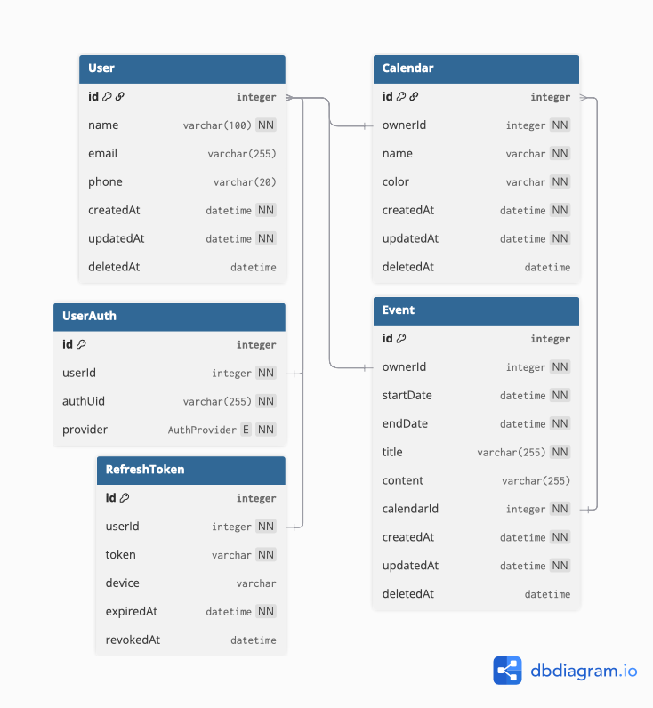

# AppleCalendar Clone ERD

> [https://dbdiagram.io](https://dbdiagram.io) 에서 작성  

## ERD 다이어그램

<div style="text-align: center">
  
</div>


## ERD 코드

```txt
enum AuthProvider {
  GOOGLE
  NAVER
  KAKAO
}

Table User {
  id integer [pk, increment]
  name varchar(100) [not null]
  email varchar(255) [unique]
  phone varchar(20) [unique]

  createdAt datetime [not null, default: "now()"]
  updatedAt datetime [not null, default: "now()"]
  deletedAt datetime [default: null]
}

Table UserAuth {
  id integer [pk, increment]
  userId integer [ref: < User.id, not null]
  authUid varchar(255) [not null]
  provider AuthProvider [not null]

  Indexes {
    (authUid, provider) [unique]
  }
}

Table RefreshToken {
  id integer [pk, increment]
  userId integer [not null, ref: < User.id]
  token varchar [not null]
  device varchar

  expiredAt datetime [not null]
  revokedAt datetime [default: null]

  Indexes {
    (token) [unique]
    (userId)
    (device, token) [unique]
  }

  note: "jwt 인증 토큰 저장, redis 에도 캐싱 필요"
}

// Memo
Table Event {
  id integer [pk, increment]
  ownerId integer [ref: < User.id, not null]
  startDate datetime [not null, default: "now()"]
  endDate datetime [not null, default: "now() + 1h"]
  title varchar(255) [not null]
  content varchar(255) [default: null]

  // calendar
  calendarId integer [ref: < Calendar.id, not null]

  createdAt datetime [not null, default: "now()"]
  updatedAt datetime [not null, default: "now()"]
  deletedAt datetime [default: null]
}


Table Calendar {
  id integer [pk, increment]
  ownerId integer [ref: < User.id, not null]
  name varchar [not null, default: "기본"]
  color varchar [not null, default: "#0000FF", note: "hex color code (#RRGGBB)"]
  
  createdAt datetime [not null, default: "now()"]
  updatedAt datetime [not null, default: "now()"]
  deletedAt datetime [default: null]

  Indexes {
    (ownerId, name) [unique]
  }
}
```

